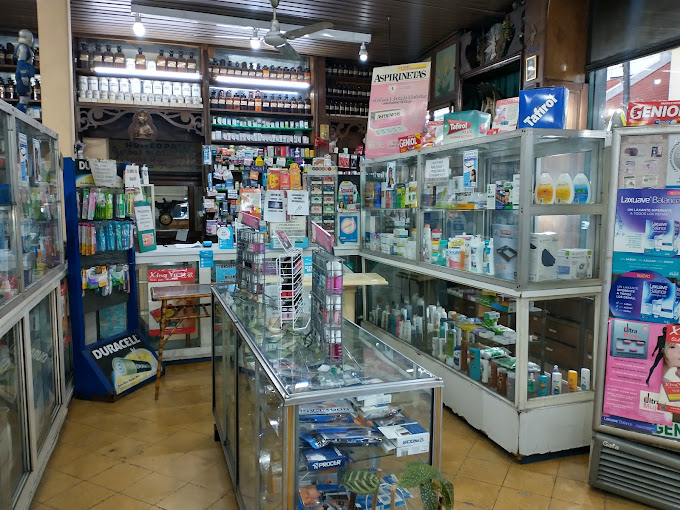

# Farmacia San José - Website

A modern, vintage-styled pharmacy website built with Next.js, featuring a unique apothecary aesthetic that honors 70+ years of tradition in Valentín Alsina, Buenos Aires.



## 🌿 About

Farmacia San José specializes in homeopathy, medicinal herbs, and magistral formulas. This website serves the local community with:

- Professional pharmacy services
- Homeopathic medicine
- Medicinal herbs and phytotherapy
- Custom magistral prescriptions
- Dermocosmetics and personal care

## 🎨 Design Philosophy

The design captures the feeling of stepping back in time to a traditional apothecary:

- **Vintage color palette**: Sage green, cream, and warm brown
- **Serif typography**: Classic, readable, professional
- **Medicinal herb motifs**: Subtle patterns and icons
- **Mobile-first approach**: Optimized for neighborhood customers
- **WhatsApp integration**: Essential for Argentine business communication

## 🛠️ Tech Stack

- **Framework**: [Next.js 15](https://nextjs.org/) (App Router)
- **Language**: TypeScript
- **Styling**: [Tailwind CSS v4](https://tailwindcss.com/)
- **Deployment**: [Vercel](https://vercel.com)
- **Forms**: [Formspree](https://formspree.io)
- **Analytics**: Google Analytics

## 🚀 Features

### Core Pages
- **Home**: Hero section with services overview and trust metrics
- **About Us**: 70-year history with values and timeline
- **Services**: 6 main service categories with detailed descriptions
- **FAQ**: Accordion-style answers to common questions
- **Contact**: Form, map, hours, and contact methods

### Technical Features
- ✅ Static site generation (SSG)
- ✅ SEO optimized with metadata and sitemap
- ✅ Schema.org structured data for local business
- ✅ Responsive design (mobile-first)
- ✅ Active navigation highlighting
- ✅ WhatsApp floating button
- ✅ Google Analytics integration
- ✅ Social media preview images (og:image)

## 📁 Project Structure
```
pharmacy-website/
├── app/
│   ├── layout.tsx              # Root layout with header/footer
│   ├── page.tsx                # Homepage
│   ├── nosotros/               # About page
│   ├── servicios/              # Services page
│   ├── preguntas-frecuentes/   # FAQ page
│   ├── contacto/               # Contact page
│   ├── robots.ts               # SEO robots.txt
│   └── sitemap.ts              # SEO sitemap.xml
├── components/
│   ├── Header.tsx              # Navigation with active links
│   ├── Footer.tsx              # Footer with hours/contact
│   ├── Hero.tsx                # Homepage hero section
│   ├── ServiceCard.tsx         # Reusable service card
│   ├── ContactForm.tsx         # Contact form with Formspree
│   ├── WhatsAppButton.tsx      # Floating WhatsApp CTA
│   ├── FAQAccordion.tsx        # Expandable FAQ items
│   └── Analytics.tsx           # Google Analytics
├── lib/
│   └── metadata.ts             # Site config and SEO helpers
├── public/
│   └── images/                 # Static images
└── globals.css                 # Tailwind + custom theme
```

## 🎨 Color Palette
```css
/* Vintage Apothecary Green */
--apothecary-green-600: #2a734e  /* Primary green */

/* Vintage Cream */
--apothecary-cream-50: #fdfcfa   /* Background */
--apothecary-cream-500: #d4c0a3  /* Accent cream */

/* Warm Brown */
--apothecary-brown-700: #755b4c  /* Text brown */
--apothecary-brown-900: #514037  /* Dark brown */
```

## 🏃 Getting Started

### Prerequisites
- Node.js 18+ 
- npm or yarn

### Installation
```bash
# Clone the repository
git clone https://github.com/yourusername/pharmacy-website.git
cd pharmacy-website

# Install dependencies
npm install

# Create environment variables
cp .env.example .env.local
# Edit .env.local with your values

# Run development server
npm run dev
```

Open [http://localhost:3000](http://localhost:3000) in your browser.

### Environment Variables
```env
# Site configuration (already in lib/metadata.ts)
NEXT_PUBLIC_SITE_URL=https://farmaciasanjose.vercel.app

# Contact form (Formspree)
NEXT_PUBLIC_FORMSPREE_URL=https://formspree.io/f/xxxxxxxx

# Analytics (Google Analytics)
NEXT_PUBLIC_GA_ID=G-XXXXXXXXXX
```

## 📦 Build & Deploy

### Build for production
```bash
npm run build
npm start
```

### Deploy to Vercel

1. Push your code to GitHub
2. Import project in [Vercel](https://vercel.com)
3. Add environment variables
4. Deploy!

Vercel automatically deploys on every push to `main`.

## 🔧 Configuration

### Update Business Info

Edit `lib/metadata.ts` to update:
- Business name, address, contact info
- Hours of operation
- Services offered
- Social media links

### Google Maps

Replace the iframe `src` in `app/contacto/page.tsx` with your actual Google Maps embed URL.

## 📱 Browser Support

- Chrome (last 2 versions)
- Firefox (last 2 versions)
- Safari (last 2 versions)
- Edge (last 2 versions)
- Mobile browsers (iOS Safari, Chrome Android)

## 🤝 Contributing

This is a private business website, but suggestions and bug reports are welcome!

## 📄 License

This project is for Farmacia San José and my dad 💚. All rights reserved.

## 📞 Contact

**Farmacia San José**
- Address: Tte. Gral. Juan Domingo Perón 2401, Valentín Alsina, Buenos Aires
- Phone: +54 11 4208-8362
- Email: farmaciasanjose19@gmail.com
- Website: [farmaciasanjose.vercel.app](https://farmaciasanjose.vercel.app)

---

Made with 💚 in Valentín Alsina, Argentina